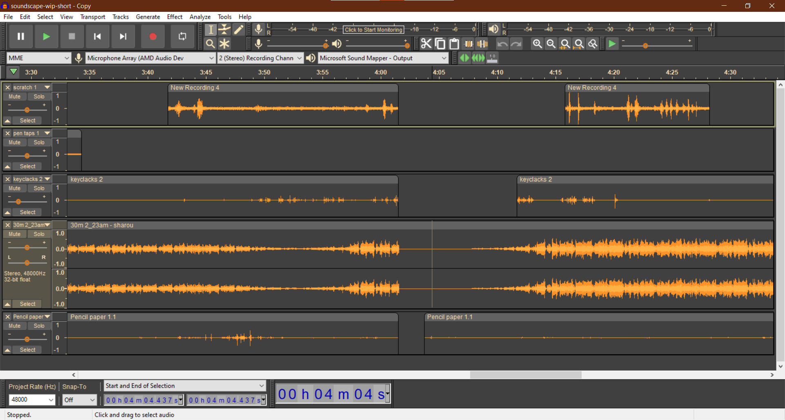

# engcmp610-soundscape

  

# Full Draft / final-for-now

  

# Blog 4 - Preview

I did some volume control on the main BGM and did some recordings of study sounds (pencil, paper, keyboard). I also wanted to switch into a spooky vibe so I'll be using background sounds to play with the BGM being the representation of mental

- [Audacity file](https://drive.google.com/file/d/1uUW0EOBiyscwP5EqqjvmMK5A8fHQtjD5/view?usp=sharing)

- [mp3 file](https://drive.google.com/file/d/1jwERcTOgYPd_Q0GSfZ93YNGY3Dwd2ykX/view?usp=sharing)